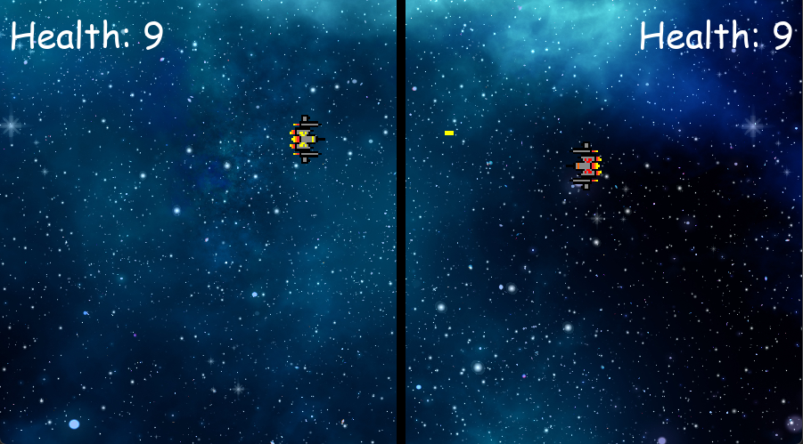

## Pygame for beginners

This is a tutorial provided by Tech With Tim that brings an introduction to creating a simple 2D game Space battle game. 

This is a very brief introduction to loading in images, moving objects and interactions with collisions showing the fundamentals of Pygame. 

Link to youtube video: [Pygame in 90 Minutes - For Beginners](https://www.youtube.com/watch?v=jO6qQDNa2UY&t=4954s)

Link to Tech With Tim Github: [Tech With Tim](https://github.com/techwithtim)